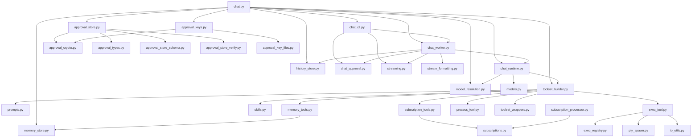

# Architecture

## 10-Second Overview

Autopoiesis is a durable CLI chat agent built on **PydanticAI** + **DBOS**.
User messages become work items on a priority queue. A DBOS worker executes
each item by running a PydanticAI agent with filesystem, shell, memory, and
subscription tools. Cryptographic approval gates shell execution and filesystem
operations (exec_tool, process_tool); memory and subscription DB operations do
not require approval.
Responses stream back to a Rich terminal UI in real time.

## System Diagram

```
┌─────────────────────────────────────────────────────────────┐
│  chat.py  (entrypoint)                                      │
│  ┌─────────────┐  ┌──────────────┐  ┌───────────────────┐  │
│  │ chat_cli.py  │→│ chat_worker  │→│  chat_runtime.py   │  │
│  │ (REPL loop)  │  │ (DBOS queue) │  │  (agent builder)  │  │
│  └──────┬───────┘  └──────┬───────┘  └────────┬──────────┘  │
│         │                 │                    │             │
│         ▼                 ▼                    ▼             │
│  ┌─────────────┐  ┌──────────────┐  ┌───────────────────┐  │
│  │ streaming.py │  │ approval_*   │  │ toolset_builder   │  │
│  │ rich_display │  │ (crypto gate)│  │ (tool wiring)     │  │
│  └─────────────┘  └──────────────┘  └────────┬──────────┘  │
│                                               │             │
│                    ┌──────────────────────────┬┘            │
│                    ▼              ▼           ▼             │
│             ┌───────────┐ ┌───────────┐ ┌──────────┐       │
│             │ exec_tool  │ │ memory_*  │ │ skills   │       │
│             │ process_*  │ │ stores    │ │ subs     │       │
│             └───────────┘ └───────────┘ └──────────┘       │
└─────────────────────────────────────────────────────────────┘
```

## Data Flow: One Chat Turn

1. **User types** a message at the `>` prompt in `chat_cli.py`
2. `_run_turn()` wraps it in a `WorkItem` (type=CHAT, priority=CRITICAL)
3. A `RichStreamHandle` is registered for the item's id in `streaming.py`
4. `enqueue_and_wait()` puts the item on the DBOS `work_queue`
5. DBOS dispatches `execute_work_item()` → `run_agent_step()` in `chat_worker.py`
6. Worker deserializes history, builds `AgentDeps`, constructs `ApprovalScope`
7. `rt.agent.run_stream_sync()` calls the PydanticAI agent with all toolsets
8. Tokens stream through `StreamHandle.write()` → `RichDisplayManager` → terminal
9. If a tool needs approval → agent returns `DeferredToolRequests`, CLI prompts user, re-enqueues
10. On completion, `WorkItemOutput` (text + serialized history) returns to CLI
11. History JSON is carried forward for the next turn

## Module Dependency Graph



## Package Responsibilities

| Cluster | Files | What it does |
|---------|-------|-------------|
| **Entry & CLI** | `chat.py`, `chat_cli.py` | Arg parsing, env loading, DBOS bootstrap, interactive REPL |
| **Agent Runtime** | `chat_runtime.py`, `chat_worker.py`, `models.py`, `work_queue.py` | Agent construction, DBOS queue worker, work item types, priority queue |
| **Tool Wiring** | `toolset_builder.py`, `toolset_wrappers.py`, `prompts.py` | Assembles all toolsets, composes system prompt, observable wrappers |
| **Exec Tools** | `exec_tool.py`, `process_tool.py`, `exec_registry.py`, `pty_spawn.py`, `io_utils.py` | Shell execution with PTY, process management, session tracking |
| **Memory** | `memory_tools.py`, `memory_store.py` | FTS5-backed persistent memory, search/save/get tools |
| **Skills** | `skills.py`, `skillmaker_tools.py` | Filesystem skill discovery, progressive disclosure, skill linting |
| **Subscriptions** | `subscription_tools.py`, `subscriptions.py`, `subscription_processor.py` | Reactive context injection, subscription registry, history materialization |
| **Approval** | `approval_types.py`, `approval_crypto.py`, `approval_keys.py`, `approval_key_files.py`, `approval_policy.py`, `approval_store.py`, `approval_store_schema.py`, `approval_store_verify.py`, `chat_approval.py` | Cryptographic tool approval with Ed25519 signing, envelope storage, policy |
| **Persistence** | `history_store.py`, `memory_store.py`, `db.py` | SQLite checkpoint store, memory FTS5 store, shared DB helpers |
| **Display** | `streaming.py`, `rich_display.py`, `stream_formatting.py` | Real-time Rich terminal UI, stream handles, event formatting |
| **Context** | `context_manager.py`, `tool_result_truncation.py` | Token-based history compaction, oversized tool result truncation |
| **Model** | `model_resolution.py` | Provider/model resolution (Anthropic, OpenRouter) |
| **Observability** | `otel_tracing.py` | OpenTelemetry span creation and configuration |
| **Utility** | `run_simple.py` | Convenience auto-approve wrapper for scripted runs |

## Key Design Decisions

### Single DBOS Queue
All work (chat, exec callbacks, future task types) flows through one priority
queue (`work_queue.py`). Priority levels (`CRITICAL` to `IDLE`) control
ordering. This keeps the execution model simple and durable — DBOS handles
retries and persistence.

### Cryptographic Approval
Shell execution and filesystem operations (via `exec_tool` and `process_tool`)
require Ed25519-signed approval envelopes. Memory and subscription tools
operate on local SQLite databases and are wired without approval predicates.
The user unlocks their signing key at startup; the CLI prompts per-tool-call.
Approvals are stored in SQLite with nonce-based replay protection. This is a
real security boundary, not just a confirmation dialog.

### Flat Entry Point
`chat.py` is the single `main()`. It wires everything — env, backend, tools,
agent, DBOS, CLI — in one linear sequence. No framework magic, no plugin
discovery. You read `chat.py` and you see the full startup.

### Ephemeral Streams
`StreamHandle` instances live in-process only. They are NOT serialized or
persisted. Durability comes from the final `WorkItemOutput` written after
each turn. Streams are a convenience layer for real-time terminal display.

### Filesystem Skills
Skills are `.md` files in a directory. The agent discovers them at startup via
`SkillDirectory`. No registration, no imports — just drop a `SKILL.md` file.
Custom skills go in the workspace; shipped skills live in the repo `skills/`
directory.
